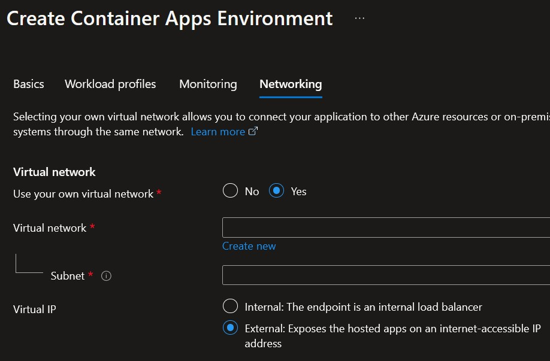
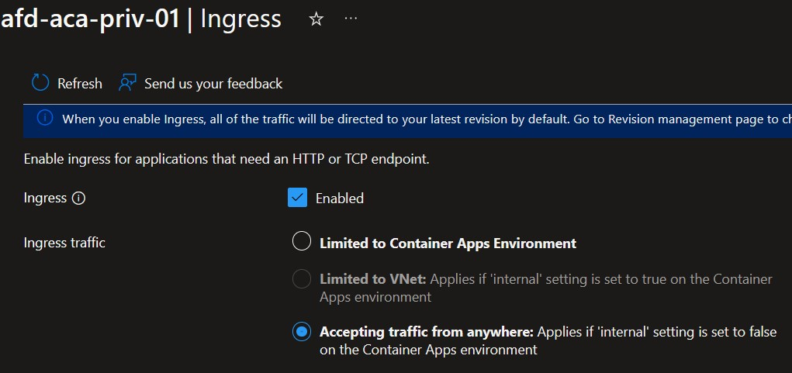
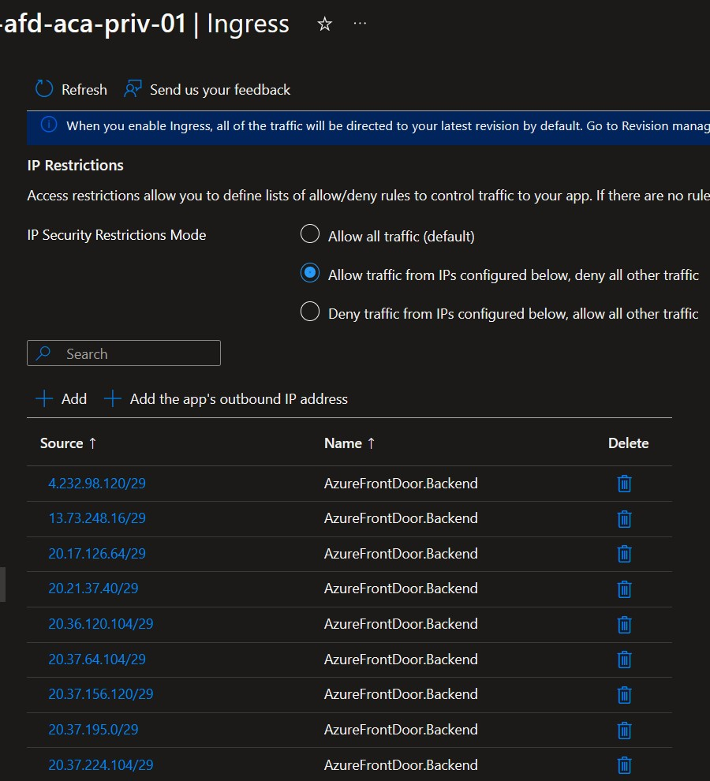

# Azure Container Apps with Azure Front Door

## Overview

This repository contains a sample application that demonstrates how to deploy an [Azure Container Apps](https://learn.microsoft.com/en-us/azure/container-apps/overview) application with Azure Front Door in the most secure manner available today.

## Problem Statement

The problem this repository explores can be described with:

- [Azure Front Door](https://learn.microsoft.com/en-us/azure/frontdoor/front-door-overview) is a global, scalable entry-point that uses the Microsoft global edge network. The [endpoint](https://learn.microsoft.com/en-us/azure/frontdoor/endpoint?tabs=azurecli), or frontend, is always exposed on the public internet. It allows to load-balance it with public DNS and enables the **Global** capability. Note: there is a [Load balancing decision tree in Azure](https://learn.microsoft.com/en-us/azure/architecture/guide/technology-choices/load-balancing-overview?toc=%2Fazure%2Ffrontdoor%2Fstandard-premium%2Ftoc.json#decision-tree-for-load-balancing-in-azure) available to choose the appropriate Load balancer.

- Backend targets are called `origins`. They use "pre known types" (most being Azure resources' types):

  - Storage (Azure Blob, Classic, Static websites)
  - Cloud service
  - App Service
  - Static Web App
  - API Management
  - Application Gateway
  - Public IP address
  - Traffic Manager
  - Azure Spring Apps
  - Container Instances
  - Container Apps
  - Any custom hostname with public access.

    The `origin` must have a public IP or a DNS hostname that can be resolved publicly, as described here: [What type of resources are currently compatible as an origin?](https://learn.microsoft.com/en-us/azure/frontdoor/front-door-faq#what-type-of-resources-are-currently-compatible-as-an-origin-)

- The Azure Front Door `origin` can't connect natively to a Virtual Network.

- To use an Azure hosted `origin` **and get its traffic kept within Azure backbone**, not through public internet, it is required to use an `Azure Private Link` origin. Details are explained here: [Secure your Origin with Private Link in Azure Front Door Premium](https://learn.microsoft.com/en-us/azure/frontdoor/private-link)

Azure Container Apps DO NOT support [Azure Private Link](https://learn.microsoft.com/en-us/azure/private-link/private-link-overview) yet.
When this feature is available, that will be the most secure option to expose [Internal](https://learn.microsoft.com/en-us/azure/container-apps/networking?tabs=workload-profiles-env%2Cazure-cli#accessibility-levels) Container Apps to the public internet through Azure Front Door.

_In the meantime, how can we deploy an Azure Container Apps application with Azure Front Door in the most secure manner available today?_

## Solutions

### Option 1: Secure the Azure Container Apps as an `origin`

This the option deployed here with the terraform code in the `./src/terraform` folder.

It consists in:

- Exposing the Container App to the Public Internet:

    - Running it in an `Azure Container Environment` for which `Networking` setting is:

      - either: `Use your own virtual network` = `No`
      - or:     `Use your own virtual network` = `Yes` AND `Virtual IP` = `External`

        

    - Exposed with an `Ingress` that is `Accepting traffic from anywhere`:

        

- **THEN** => Securing access to the Container App with additional `Ingress` settings:

  - Set `Insecure connections` NOT `Allowed` (i.e. unchecked)

  - Set `IP Restrictions` to `Allow traffic from IPs configured below, deny all other traffic`, adding the Azure Front Door Backend Public IP ranges.
  
    
  
  
  
  > Note: The Azure IP addresses are available [here](https://www.microsoft.com/en-us/download/details.aspx?id=56519), looking for `AzureFrontDoor.Backend` values.

