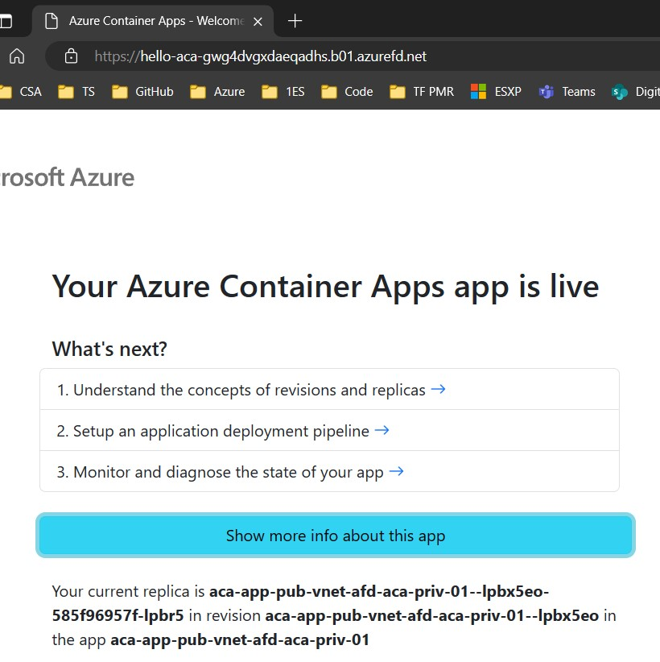
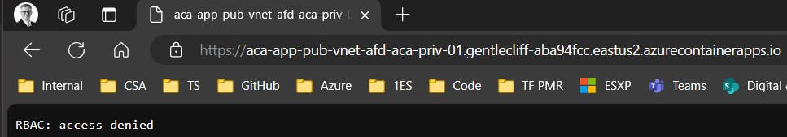
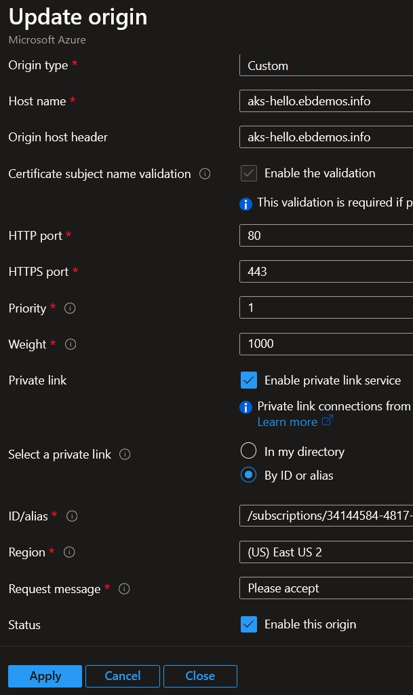
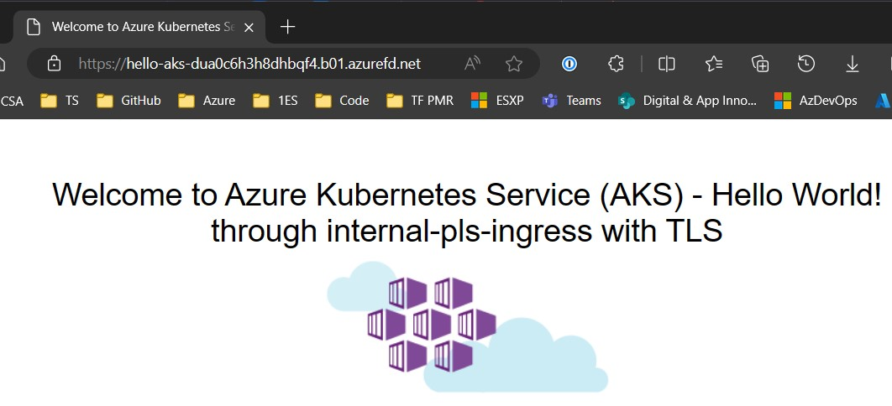

# Azure Container Apps with Azure Front Door

## Overview

This repository contains a sample application that demonstrates how to deploy an [Azure Container Apps](https://learn.microsoft.com/en-us/azure/container-apps/overview) application with Azure Front Door in the most secure manner available today.

## Problem Statement

The problem this repository explores can be described with:

- [Azure Front Door](https://learn.microsoft.com/en-us/azure/frontdoor/front-door-overview) is a global, scalable entry-point that uses the Microsoft global edge network. The [endpoint](https://learn.microsoft.com/en-us/azure/frontdoor/endpoint?tabs=azurecli), or frontend, is always exposed on the public internet. It allows to load-balance it with public DNS and enables the **Global** capability.

  > Note: there is a [Load balancing decision tree in Azure](https://learn.microsoft.com/en-us/azure/architecture/guide/technology-choices/load-balancing-overview?toc=%2Fazure%2Ffrontdoor%2Fstandard-premium%2Ftoc.json#decision-tree-for-load-balancing-in-azure) available to choose the appropriate Load balancer.

- Backend targets are called `origins`. They use "pre known types" (most being Azure resources' types):

  - Storage (Azure Blob, Classic, Static websites)
  - Cloud service
  - App Service
  - Static Web App
  - API Management
  - Application Gateway
  - Public IP address
  - Traffic Manager
  - Azure Spring Apps
  - Container Instances
  - Container Apps
  - Any custom hostname with public access.

    The `origin` must have a public IP or a DNS hostname that can be resolved publicly, as described here: [What type of resources are currently compatible as an origin?](https://learn.microsoft.com/en-us/azure/frontdoor/front-door-faq#what-type-of-resources-are-currently-compatible-as-an-origin-)

- The Azure Front Door `origin` can't connect natively to a Virtual Network.

- To use an Azure hosted `origin` **and get its traffic kept within Azure backbone**, not through public internet, it is required to use an `Azure Private Link` origin. Details are explained here: [Secure your Origin with Private Link in Azure Front Door Premium](https://learn.microsoft.com/en-us/azure/frontdoor/private-link)

Azure Container Apps DO NOT support [Azure Private Link](https://learn.microsoft.com/en-us/azure/private-link/private-link-overview) yet.
When this feature is available, that will be the most secure option to expose [Internal](https://learn.microsoft.com/en-us/azure/container-apps/networking?tabs=workload-profiles-env%2Cazure-cli#accessibility-levels) Container Apps to the public internet through Azure Front Door.

_In the meantime, how can we deploy an Azure Container Apps application with Azure Front Door in the most secure manner available today?_

## Solutions

### Option 1: Secure the Azure Container Apps as an `origin`

#### This repository example

The following can be deployed with the terraform code in the `./src/terraform` folder.

It follows the [Secure traffic to Azure Front Door origins](https://learn.microsoft.com/en-us/azure/frontdoor/origin-security?tabs=app-service-functions&pivots=front-door-standard-premium) recommendations and consists in:

- [IP address filtering](https://learn.microsoft.com/en-us/azure/frontdoor/origin-security?tabs=app-service-functions&pivots=front-door-standard-premium#ip-address-filtering):

    - Exposing the Container App to the Public Internet:

        - Running it in an `Azure Container Environment` for which `Networking` setting is:

          - either: `Use your own virtual network` = `No`
          - or:     `Use your own virtual network` = `Yes` AND `Virtual IP` = `External`

            

        - Exposed with an `Ingress` that is `Accepting traffic from anywhere`:

            

    - **THEN** => Securing access to the Container App with additional `Ingress` settings:

      - Set `Insecure connections` to NOT `Allowed` (i.e. unchecked)

      - Set `IP Restrictions` to `Allow traffic from IPs configured below, deny all other traffic`
      
      - Add the Azure Front Door Backend Public IP ranges:
      
        

      > Note: The Azure IP addresses are available [here](https://www.microsoft.com/en-us/download/details.aspx?id=56519), looking for `AzureFrontDoor.Backend` values.

    - With that setting:

      - The application is accessible through the Azure Front Door endpoint (note the `.azurefd.net` suffix):

          

      - But not from the Container App URL directly (note the `.azurecontainerapps.io` suffix):

          

      - As the communication is TLS / HTTPS encrypted, this setup is secure, even if going through the Public internet.

- [Front Door identifier](https://learn.microsoft.com/en-us/azure/frontdoor/origin-security?tabs=app-service-functions&pivots=front-door-standard-premium#front-door-identifier):

  - When Front Door makes a request to an `origin`, it adds the `X-Azure-FDID` request header. The origin can inspect the header on incoming requests andd `allow`/`reject` the connection.

  - To use this identifier, the application must inspect the HTTP headers and do the check. It requires coding or settings. These are not implemented in the default Azure Container Apps application used in this repository.

The above describes what is found and used in this repository.

#### A variation with a reverse proxy container in the Container App Environment

There is variation of it to leverage the same features which is:

- Creating only 1 `Container App` with `Ingress traffic` set to `Accepting traffic from anywhere` with the `IP Restrictions`, that runs a `reverse proxy` container (like nginx). This reverse proxy is configured to do the `X-Azure-FDID` filtering and uses the other `Container Apps` as `backends`.

- The other `Container Apps`, the ones with the applications, are deployed with `Ingress traffic` set to `Limited to Container Apps Environment`.

### Option 2: Drop Azure Front Door and use Azure Application Gateway

This option doesn't match the problem statement, but it is a valid alternative.

It is documented here: [Protect Azure Container Apps with Web Application Firewall on Application Gateway](https://learn.microsoft.com/en-us/azure/container-apps/waf-app-gateway?tabs=default-domain)

### Option 3: Wait for Azure Container Apps to support Azure Private Link

- When `Private Link` will be available for `Container Environment`, one can guess the connection will be similar to the one actually available with `AKS` through an `Internal Load Balancer` with `Private Link Service`.

- Here's an example of an application, exposed as a `Front Door endpoint` and backed by an `origin` that uses an `AKS internal ingress controller` through `Private Link Service`:

    - the `origin`

    

    - the result calling the `Front Door` endpoint

    

  > Note: Using `Private Link` as an `origin` enforces the `Certificate subject name validation`. The `Origin host header` must be matched with the appropriate TLS certificate for the connection to happen.
